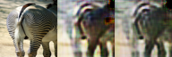
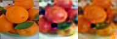

# CycleGAN in Pure NumPy

A from-scratch reimplementation of CycleGAN with NumPy only: no PyTorch, no TensorFlow, no autograd. Every forward and backward pass is written by hand.

> **Paper reimplemented:** J.-Y. Zhu, T. Park, P. Isola, and A. A. Efros. *Unpaired Image-to-Image Translation using Cycle-Consistent Adversarial Networks.* ICCV, 2017. [arXiv:1703.10593](https://arxiv.org/abs/1703.10593)

<p align="center">
  
  &nbsp;
  
</p>
<p align="center"><sub>Test images after 20 epochs at 64 x 64. Each strip shows the input, its translation, and the cycle reconstruction. Left: zebra to horse. Right: orange to apple.</sub></p>

CycleGAN learns to translate images between two domains, such as horses and zebras, without paired examples. Two generators translate in opposite directions, and a cycle consistency loss asks that translating an image and translating it back returns the original. The goal of this project is to understand each piece of the method by building it, and to check whether the cycle consistency effect still appears on a small CPU setup. The architecture and losses follow the paper.

## Results

Both datasets use the same setup: 150 images per side, 64 x 64 inputs, 20 epochs. One run takes about 2.5 hours on an Apple Silicon CPU.

Test-set ℓ1 errors at epoch 20 (pixels in [-1, 1], lower is better):

| Metric | horse2zebra | apple2orange |
| --- | --- | --- |
| Cycle A → B → A | 0.199 | 0.202 |
| Cycle B → A → B | 0.224 | 0.219 |
| Identity on A | 0.184 | 0.189 |
| Identity on B | 0.216 | 0.213 |

The cycle loss decreases steadily on both datasets (from 0.73 to 0.32 on horse2zebra, from 0.84 to 0.31 on apple2orange), so the central idea of the paper reproduces at this scale. Color changes work well, but zebra stripes stay blurry at 64 x 64. The discriminator also wins too early: its loss falls below the LSGAN equilibrium of 0.25 around epoch 5 and reaches 0.04 at epoch 20. The full analysis is in the [report](docs/report.pdf).

## Environment

The project uses its own environment, `cyclegan-numpy`, defined in [`environment.yml`](environment.yml):

- Python 3.12;
- NumPy for all the computations, Pillow for images, and tqdm for progress bars.

Everything runs on the CPU, and no GPU is needed. Downloading a dataset also needs `curl` and `unzip`.

```bash
mamba env create -f environment.yml   # create the environment once
mamba activate cyclegan-numpy         # activate it in every new terminal
```

## Data

The datasets are the public ones of the original paper. `download_data.sh` fetches them from the official Berkeley mirror (apple2orange, horse2zebra, monet2photo, maps, and others).

## Quick start

```bash
./download_data.sh apple2orange
python train.py --data datasets/apple2orange --n_res 6 --max_per_side 150 --out runs/apple2orange_64
python test.py --ckpt runs/apple2orange_64/ckpt/last.pkl --data datasets/apple2orange --n_res 6 --out results_apple2orange
```

Every command and its options are in [docs/usage.md](docs/usage.md).

## Repository layout

```
layers.py, models.py, optim.py   the network, written in NumPy
data.py                          data loading
train.py, test.py                training and evaluation
download_data.sh                 dataset download
assets/                          figures of this README
docs/                            implementation, usage, and report
```

## Documentation

- [Implementation](docs/implementation.md): the layers, the architecture, the losses, and the training loop.
- [Usage](docs/usage.md): setup and every command, with its options and outputs.
- [Report](docs/report.pdf): the full write-up, with training curves and discussion.

## References

- J.-Y. Zhu, T. Park, P. Isola, and A. A. Efros. Unpaired image-to-image translation using cycle-consistent adversarial networks. *ICCV*, 2017.
- I. Goodfellow, J. Pouget-Abadie, M. Mirza, B. Xu, D. Warde-Farley, S. Ozair, A. Courville, and Y. Bengio. Generative adversarial nets. *NeurIPS*, 2014.
- J. Johnson, A. Alahi, and L. Fei-Fei. Perceptual losses for real-time style transfer and super-resolution. *ECCV*, 2016.
- P. Isola, J.-Y. Zhu, T. Zhou, and A. A. Efros. Image-to-image translation with conditional adversarial networks. *CVPR*, 2017.
- X. Mao, Q. Li, H. Xie, R. Y. K. Lau, Z. Wang, and S. P. Smolley. Least squares generative adversarial networks. *ICCV*, 2017.
- D. Ulyanov, A. Vedaldi, and V. Lempitsky. Instance normalization: the missing ingredient for fast stylization. arXiv:1607.08022, 2016.
- A. Odena, V. Dumoulin, and C. Olah. Deconvolution and checkerboard artifacts. *Distill*, 2016.
- D. P. Kingma and J. Ba. Adam: a method for stochastic optimization. *ICLR*, 2015.

## License

The code of this project is released under the [MIT License](LICENSE). Please cite the original CycleGAN paper if you build on it.
